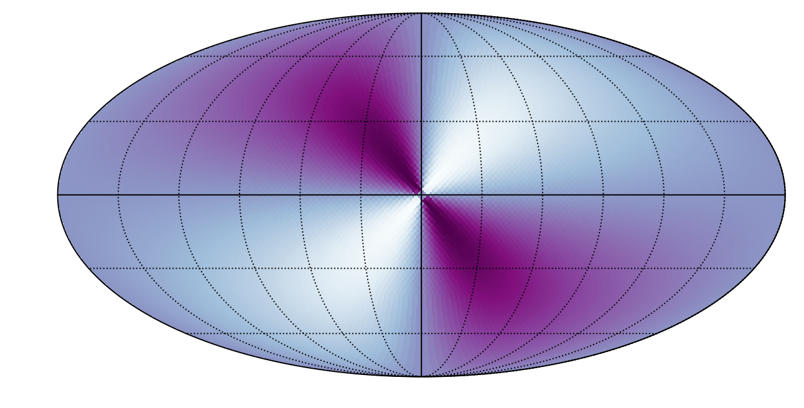
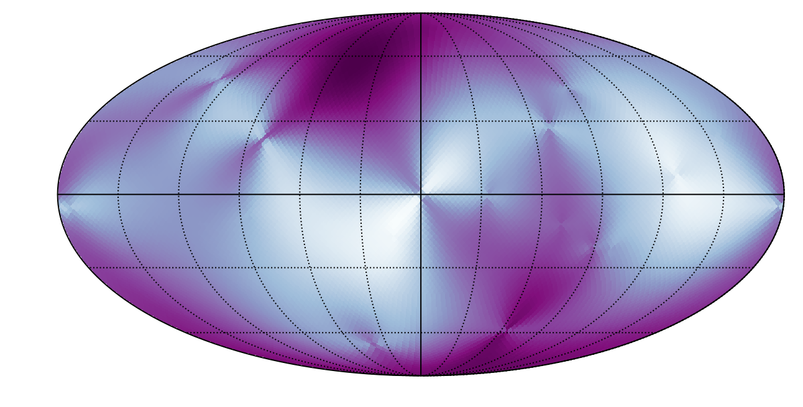
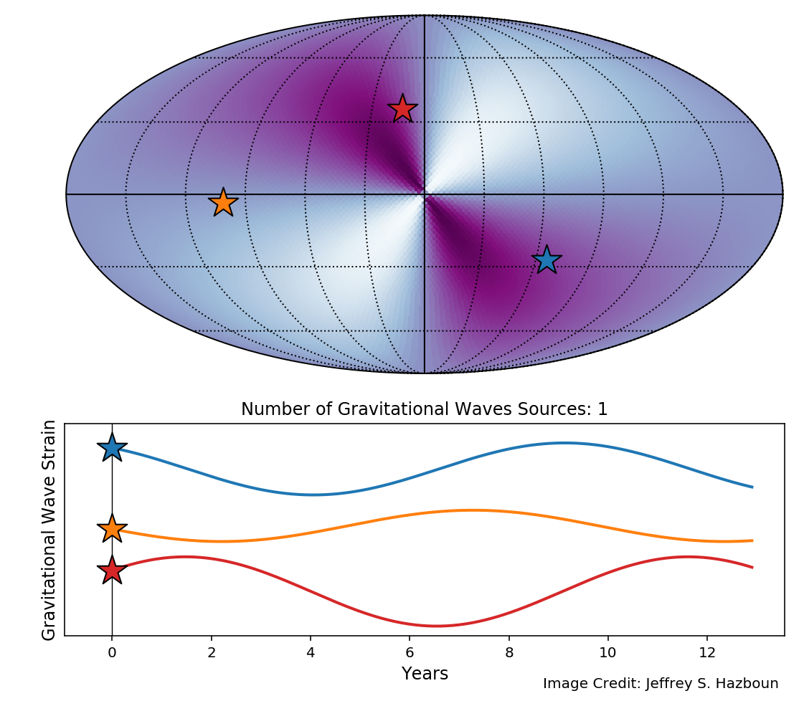
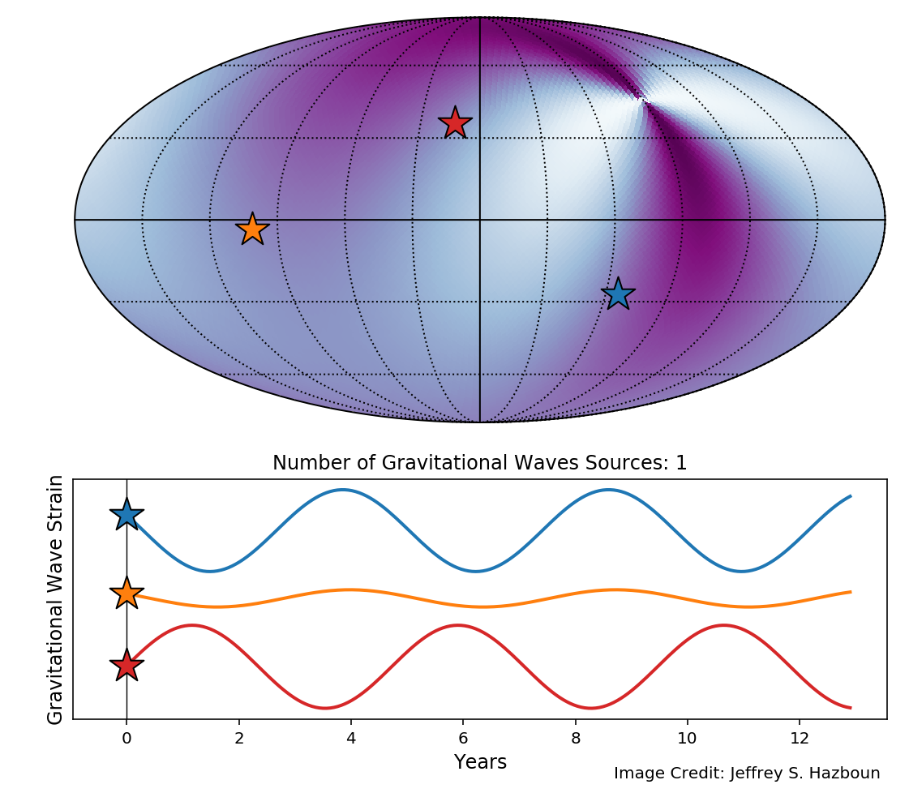
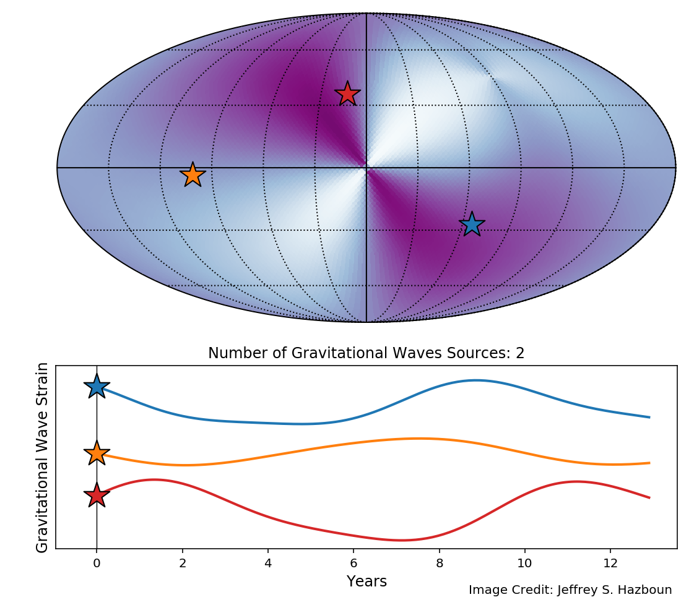
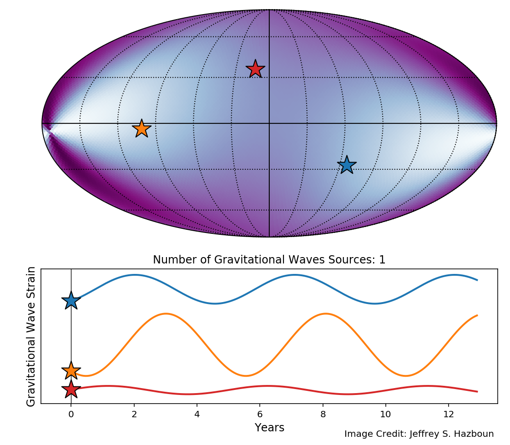
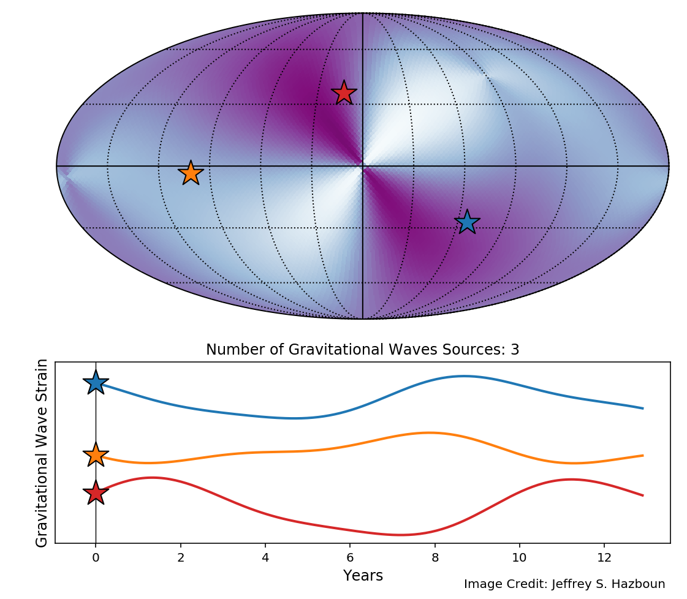
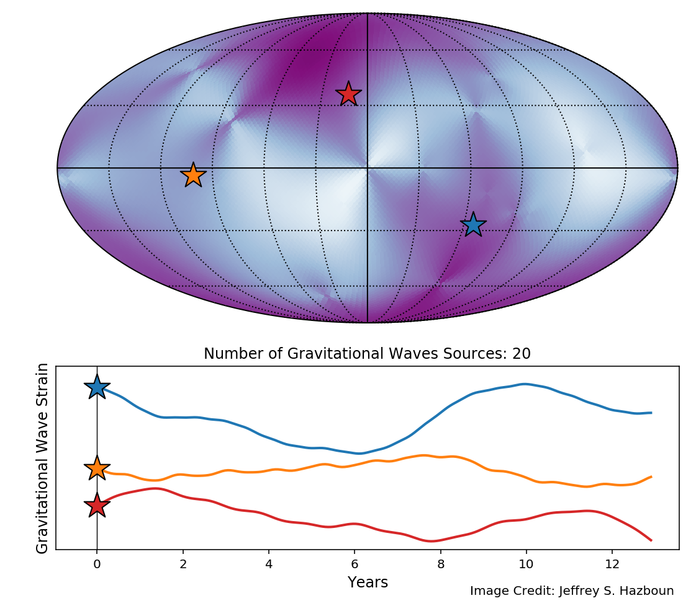

PTA Supermassive Black Holes Single Source to GWB
=================================================
.. note:: This tutorial was generated from a Jupyter notebook that can be
          downloaded `here <_static/notebooks/pta_smbbh.ipynb>`_.

Here we run through a simple example of making a gravitational wave
skymap that calculates the gravitational waves strain and the time of
arrival perturbation of pulsar pulses.

.. code:: ipython3

    import matplotlib
    import numpy as np
    import matplotlib.pyplot as plt
    import healpy as hp
    %config InlineBackend.figure_format = 'retina'

.. code:: ipython3

    from gw_sky import gwsky

.. code:: ipython3

    pop = gwsky.smbbh_pop()

.. code:: ipython3

    L = 20
    costh = np.random.uniform(-1,1,size= L-3)
    th = np.arccos(costh)
    ph = np.random.uniform(0,2*np.pi,size= L-3)
    th = np.append([np.pi/2,np.pi/4,np.pi/2+0.1],th)
    ph = np.append([0,3*np.pi/2,np.pi-0.1],ph)
    gw = []
    for ii in range(L):
        freq = pop['GWFreq'][ii]
        h = -pop['Strain'][ii] # Strains are saved as negative values for some reason...
        gw.append(gwsky.SMBBH(freq,h,th[ii],ph[ii]))

.. code:: ipython3

    t = np.linspace(0,12.9*365.25*24*3600,200)

.. code:: ipython3

    NSIDE = 32
    NPIX = hp.nside2npix(NSIDE)
    IPIX = np.arange(NPIX)
    theta, phi = hp.pix2ang(nside=NSIDE,ipix=IPIX)

.. code:: ipython3

    sky = gwsky.GWSky(gw,theta,phi)

.. code:: ipython3

    #One can either
    # str = sky.strain(t)
    res = sky.residuals(t)

.. code:: ipython3

    res.shape

.. parsed-literal::

    (12288, 20, 200)

.. code:: ipython3

    hp.mollview(res[:,0,0], cbar=False,title='',cmap='BuPu')
    hp.graticule(verbose=False)

.. code:: ipython3

    hp.mollview(np.sum(res[:,:,0],axis=1), cbar=False,title='',cmap='BuPu')
    hp.graticule(verbose=False)

.. code:: ipython3

    yr_in_sec = 365.25*24*3600

The following are convenience functions for plotting.

.. code:: ipython3

    def maxmin(array):
        """Return the max an min of an array."""
        return array.max(), array.min()

    def gw_sum(array, n='all'):
        '''
        Convenience function to return either a single source,
        sum of a list of sources indicated by index or all summed sources.
        '''
        if n=='all':
            return np.sum(array,axis=1)
        elif isinstance(n,list):
            return np.sum(array[:,n,:],axis=1)
        elif isinstance(n,int):
            return array[:,n,:]

The following method plots individual GW sources and sums of GW sources
frame by frame for use in animations.

.. code:: ipython3

    def plot_gw(residuals,
                psrs=[0,1,[0,1],'all'],
                Nt=1,
                action='show',
                name='./gwb_resids/gwb_full'):
        ii = 0
        for p in psrs:
            res = gw_sum(residuals,n=p)
            Max, Min = maxmin(res)
            idx1 = 9000
            idx2 = 6500
            idx3 = 2500
            ang1=hp.pix2ang(NSIDE,idx1)
            ang2=hp.pix2ang(NSIDE,idx2)
            ang3=hp.pix2ang(NSIDE,idx3)

            if p=='all':
                space = 0.01*2*(res[idx1,:].max()+res[idx2,:].max()+res[idx3,:].max())
            else:
                space = 0.1*2*(res[idx1,:].max()+res[idx2,:].max()+res[idx3,:].max())
            shifts = [np.abs(res[idx1,:].min())+ res[idx2,:].max() + space,
                      0,
                      res[idx2,:].min() - res[idx3,:].max() - space]

            for n in range(Nt):
                fig, (ax1, ax2) = plt.subplots(2, 1, figsize=[9,9],
                                               gridspec_kw={'height_ratios': [2, 1]})
                # Plot the sky map
                plt.sca(ax1)
                hp.mollview(res[:,n], cbar=False,title='',cmap='BuPu',min=Min,max=Max, hold=True)
                hp.graticule(verbose=False)

                # Plot the stars on the sky map
                hp.projscatter(ang1[0],ang1[1],s=22**2,marker='*',color='C0',edgecolors='k',zorder=3)
                hp.projscatter(ang2[0],ang2[1],s=22**2,marker='*',color='C1',edgecolors='k',zorder=3)
                hp.projscatter(ang3[0],ang3[1],s=22**2,marker='*',color='C3',edgecolors='k',zorder=3)

                # Plot the traces on the traceplot. Shift by the amount calculated above.
                ax2.plot(t/yr_in_sec,res[idx1,:]+shifts[0],color='C0', lw=2)
                ax2.plot(t/yr_in_sec,res[idx2,:]+shifts[1],color='C1', lw=2)
                ax2.plot(t/yr_in_sec,res[idx3,:]+shifts[2],color='C3', lw=2)

                # Plot the stars on the trace plot
                ax2.scatter(0,res[idx1,0]+shifts[0],s=22**2,marker='*',color='C0',edgecolors='k',zorder=3)
                ax2.scatter(0,res[idx2,0]+shifts[1],s=22**2,marker='*',color='C1',edgecolors='k',zorder=3)
                ax2.scatter(0,res[idx3,0]+shifts[2],s=22**2,marker='*',color='C3',edgecolors='k',zorder=3)

                # Plot the verticle line that shows the current time.
                ax2.axvline(t[n]/yr_in_sec, linewidth=0.7,color='k')
                ax2.set_yticks([])
                ax2.set_xlabel('Years',fontsize=12)
                ax2.set_ylabel(r'Gravitational Wave Strain',fontsize=12)
    #             ax2.set_ylabel(r'Change in Arrival Time',fontsize=12)
                if isinstance(p,int):
                    N = 1
                elif isinstance(p,list):
                    N = len(p)
                elif p=='all':
                    N = L
                ax2.set_title('Number of Gravitational Waves Sources: {0}'.format(N))
                fig.text(x=0.64,y=0.12,s='Image Credit: Jeffrey S. Hazboun')
                box = ax2.get_position()

                box.y0 = box.y0 + 0.051
                box.y1 = box.y1 + 0.051
                ax2.set_position(box)

                if action=='save':
                    plt.savefig('{0}_{1}.png'.format(name,ii), dpi=171, bbox_inches='tight')
                elif action=='show':
                    plt.show()

                ii+=1
                plt.close()

The above script will iterate through the sky maps to make as many
animations as you would like. Use a list of either integers, list of
integers or the string ``'all'``. An individual index will return a
single source, a list of indices will add togethers those sources and
``'all'`` will sum all the sources. ``Nt`` is the number of frames in
the animation and will error if you exced the number of time steps in
the array.

Below we use the ``action='show'`` kwarg to show the plots.

.. code:: ipython3

    plot_gw(res, psrs=[0,1,[0,1],2,[0,1,2],'all'], Nt=1, action='show')#

Executing the following cell would with the ``action='show'`` kwarg will
save the plots to the ``'PLOT_DIR'`` directory with file names
``'gwb_full_0.pdf'`` and so forth.

.. code:: ipython3

    # plot_gw(res,psrs=[0,1,[0,1],2,[0,1,2],'all'], Nt=200, action='save', name='./PLOT_DIR/gwb_full')#

Making Animations
-----------------

The following cells require the package ``ffmpeg`` which can be
installed via conda or your favorite package manager for ``c`` code.

The next cell makes an ``mp4`` movie out of the frames saved above.

.. code:: ipython3

    #! ffmpeg -r 18 -f image2 -s 1920x1080 -i one_source_%d.png -vcodec libx264 -crf 15  -pix_fmt yuv420p one_source.mp4

The following two cells make a ``gif`` from the frames saved above.

The next cell makes a color palette for use in a complex filter. This
makes the gif much cleaner looking.

.. code:: ipython3

    #! ffmpeg -i gwb_full_%d.png -vf palettegen palette.png

The next cell uses the pallete file made above and the frames to make a
animated ``gif``.

.. code:: ipython3

    #! ffmpeg -y -i gwb_full_%d.png -i palette.png -filter_complex "fps=45,scale=1032:-1:flags=lanczos[x];[x][1:v]paletteuse" gwb_full.gif
